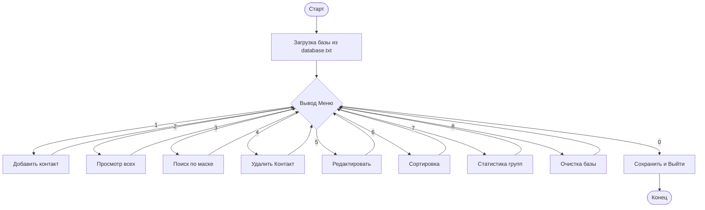

# ОТЧЕТ ПО УЧЕБНОЙ ПРАКТИКЕ
## Информационная система «Smart-Contacts»

**Выполнил:** Акиншин
**Группа:** [Введите Номер Группы]

---

### 1. Постановка задачи
Необходимо разработать консольное приложение C++ для управления базой личных и деловых контактов. Приложение должно обеспечивать надежное иерархическое хранение данных, строгую валидацию пользовательского ввода и возможность гибкого поиска, включая поддержку нескольких ключевых слов.

---

### 2. Описание структур данных

| Структура | Поля | Тип | Обоснование выбора типа |
| :--- | :--- | :--- | :--- |
| **Date** | `day`, `month`, `year` | `int` | Целочисленные поля для стандартных календарных значений. |
| **Phone** | `countryCode` | `int` | Код страны (до 3 цифр). |
| | `cityCode` | `int` | Код города/оператора. |
| | `number` | `long long` | 10+ цифр телефонного номера превышают ограничение стандартного `int` (до 2 млрд). Требуется `long long` (64-бит). |
| **Group** | `WORK`, `FAMILY`, `FRIENDS`, `OTHERS` | `enum` | Перечисление для строгого фиксированного набора категорий, исключающего ошибки ручного ввода. |
| **Contact** | `lastName`, `firstName`, `middleName` | `string` | Текстовые ФИО, разделенные для удобной сортировки и фильтрации. |
| | `phone` | `Phone` | Вложенный объект для структурирования телефона. |
| | `birthDate` | `Date` | Вложенный объект для структурирования даты. |
| | `email` | `string` | Текст для Email с валидацией формата. |
| | `category` | `Group` | Категория из перечисления. |

---

### 3. Алгоритм работы программы

#### Блок-схема основного меню (Концепт)

#### Логика Валидации Email:
1. Метод `isValidEmail(const string& email)` использует `std::string::find('@')`.
2. Если `@` не найдена — возврат `false`.
3. Далее ищется `.` **после** индекса `@`. (`find('.', atPos)`).
4. Если точка найдена на позиции, большей `atPos + 1` — возврат `true`, иначе — `false`.

#### Логика Сортировки:
Программа поддерживает два типа сортировки реализованных через `std::sort` и лямбда-функции:
1. **По алфавиту**: Объединяет `lastName` + `firstName` в единый нижний регистр и сравнивает строки построчно (`<`).
2. **По дате рождения**: Поочерёдно сравнивает `year`, `month` и `day`. Если год меньше — элемент идёт раньше.

---

### 4. Тестирование (Тест-кейсы)

| № | Описание действия | Ожидаемый результат | Фактический результат | Статус |
| :--- | :--- | :--- | :--- | :--- |
| 1 | Ввод буквы в поле `Год рождения` | Программа выдает ошибку: "Ошибка ввода. Введите число:" и ждет повтора. | Соответствует. Цикл `getValidInt` через `cin.clear()` очищает буфер. | **Ok** |
| 2 | Ввод Email без символа `@` | Сообщение: "Некорректный формат почты. Нужен @ и точка. Повторите:" | Соответствует. | **Ok** |
| 3 | Поиск по маске `abc` (если таких нет) | Выводится сообщение: "Контакты не найдены." | Соответствует. | **Ok** |
| 4 | Сохранение пустого списка в файл | Файл `database.txt` очищается, программа успешно закрывается без падения. | Соответствует, сохраняется пустой файл. | **Ok** |
| 5 | Ввод длинной фамилии (например, 20 симв.) | В таблице фамилия аккуратно отображается с добавлением точек: `Фамилия...` | Метод использует `.substr(0,15) + "..."`. Ошибок верстки нет. | **Ok** |

---

### 5. Примечания о реализации
- Реализованы **2 дополнительные функции:** `showStats()` (статистика по группам) и `clearDatabase()` (полная очистка вектора).
- **Кодировка на Windows**: В `main()` установлена кодовая страница **1251 (ANSI)** для обеспечения безошибочной работы потока `cin >>` с кириллицей. 
- **Файлы сборки**: Для преподавателя сгенерированы файлы `.sln` и `.vcxproj`, позволяющие собрать проект обычным кликом в Visual Studio.

